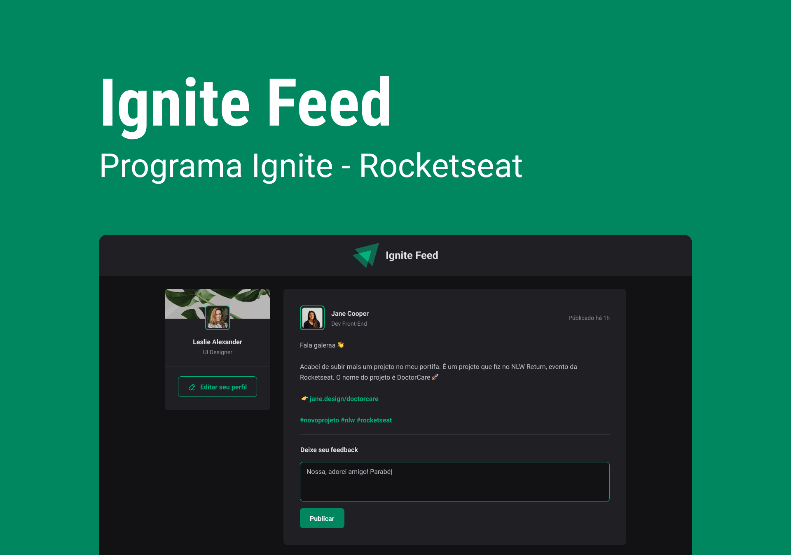

<p align="center">
  
  </p>

## **💻** Projeto

“Vamos criar uma rede social”. Todo dev já ouviu isso pelo menos uma vez na vda. Mas como será que funciona uma, como fazer uma publicação, comentar - e apagar o comentário - e até mesmo curtir?

Para conclusão de módulo, a fim consolidar ainda mais meus conhecimentos sendo alinhado com as novas e melhores práticas e tecnologias disponíveis no mundo da tecnologia, realizei durante o programa de aceleração “Ignite - ReactJS”, promovido pela Rocketseat, uma aplicação Frontend chamado Ignite Feed, onde podemos treinar minhas habilidades com ReactJS, utilizando Hooks, componentes, propriedades, Imutabilidades, etc. Além disso, para estilizando foi utilizado CSS Modules.

<p align="center">
  
</p>

## Tecnologias utilizadas

- [Vite](https://vitejs.dev/)
- [Typescript](https://www.typescriptlang.org/)
- [ReactJS](https://pt-br.reactjs.org/)
- [Immer](https://github.com/immerjs/immer)
- [Date-fns](https://date-fns.org/)
- [Phosphor icons](https://phosphoricons.com/)

## **🔖** Layout

Você pode visualizar o layout do projeto através do link abaixo:

- [Figma](https://www.figma.com/community/file/1113573231685349036/Ignite-Feed)

## **🚀** Como Executar

Antes de baixar o projeto você vai precisar ter instalado na sua máquina as seguintes ferramentas:

- [Git](https://git-scm.com/)
- [NodeJS](https://nodejs.org/en/)
- [NPM](https://www.npmjs.com/)

```bash
## Clone o projeto em sua máquina
git clone https://github.com/srsouzaj/igniteFeed.git

# Acessar o projeto no terminal
$ cd igniteFeed

# Instalar as dependências
$ npm install

# Executar o servidor em modo de desenvolvimento
$ npm run dev
```

## 📝 License

Esse projeto está sob a licença MIT. Veja o arquivo [LICENSE](https://github.com/srsouzaj/igniteFeed/blob/master/LICENSE.MD) para mais detalhes.

Feito com ❤️ por Jorge de Souza
